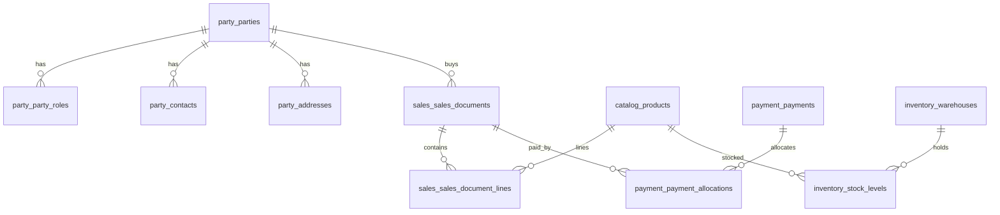

# PostgreSQL schema

RustERP uses **one PostgreSQL schema per functional domain**, aligned with proto
packages (`rusterp.<area>.v1`) and future `rusterp-*` crates. Migrations live in
[`crates/rusterp-storage/migrations/`](../crates/rusterp-storage/migrations/).

**Single-tenant:** no `tenant_id` columns.

## Schema map

| PostgreSQL schema | Module id | MVP | Rust crate (current / planned) |
|-------------------|-----------|-----|--------------------------------|
| `core` | `core` | always-on | `rusterp-storage` |
| `auth` | — | yes (schema only) | future auth crate |
| `party` | `parties` | yes | `rusterp-parties` |
| `catalog` | `catalog` | yes | `rusterp-catalog` (planned) |
| `sales` | `sales` | yes | `rusterp-sales` (planned) |
| `payment` | `payments` | yes | `rusterp-payments` (planned) |
| `inventory` | `inventory` | toggleable | `rusterp-inventory` (planned) |
| `purchase` | — | stub | post-MVP |
| `accounting` | — | stub | post-MVP (not full GL) |
| `crm` | — | stub | post-MVP |
| `project` | — | stub | post-MVP |
| `hr` | — | stub | post-MVP |
| `manufacturing` | — | stub | post-MVP |

Module activation is persisted in `core.modules` (mirrors `rusterp-modules` registry).

## Cross-cutting conventions

### Row metadata (business tables)

| Column | Type | Notes |
|--------|------|-------|
| `id` | `UUID PK DEFAULT gen_random_uuid()` | Exposed as hyphenated string in gRPC |
| `created_at` / `updated_at` | `TIMESTAMPTZ` | `core.set_updated_at()` trigger |
| `created_by` / `updated_by` | `UUID → auth.users` | Nullable until auth ships |
| `row_version` | `BIGINT` | Optimistic locking |
| `active` | `BOOLEAN` | Soft archive |

### Money

```text
amount_minor BIGINT NOT NULL   -- integer minor units (e.g. cents)
currency     CHAR(3) NOT NULL -- ISO 4217; default from core.settings
```

Org default currency: `core.settings` key `org.default_currency` (default `AUD`).

### Document numbering

`core.document_sequences` — per-domain prefixes (e.g. `sales.invoice` → `INV`).

### Audit

`core.audit_events` — append-only; populated by future audit technical module.

## Domain overview



### `party`

- `party.parties` — aggregate root
- `party.party_roles` — ENUM: `customer`, `supplier`, `prospect`
- `party.contacts` — people at a party
- `party.addresses` — billing / shipping / other
- `party.party_identifiers` — ABN, ACN, VAT, etc.

**Implemented:** `PostgresPartyRepository` in `rusterp-parties`.

### `catalog`

- `catalog.units_of_measure`, `catalog.product_categories`
- `catalog.products` — type: stock / service / consumable
- `catalog.price_lists`, `catalog.prices`

**Schema only** — no Rust repository yet.

### `sales`

Unified document model: **quotes → orders → invoices + credit notes**.

- `sales.sales_documents` — header (`kind`, `status`, `number`, totals, `source_document_id` chain)
- `sales.sales_document_lines` — line items (optional `product_id` for free-text lines)

Statuses: `draft`, `confirmed`, `posted`, `cancelled`.

**Schema only.**

### `payment`

- `payment.bank_accounts`
- `payment.payments` — inbound/outbound
- `payment.payment_allocations` — payment ↔ invoice/credit note

**Schema only.**

### `inventory` (toggleable)

- `inventory.warehouses`
- `inventory.stock_levels` — on-hand + reserved qty
- `inventory.stock_moves` — linked to sales documents

**Schema only.**

### Post-MVP stubs

Minimal placeholder tables in `purchase`, `accounting`, `crm`, `project`, `hr`,
`manufacturing` — see migration `0009_future_stubs.sql`.

## Migrations

| File | Purpose |
|------|---------|
| `0001_parties_bootstrap.sql` | Legacy public tables (superseded; dropped in 0002) |
| `0002_core_foundation.sql` | Schemas, core platform, drop bootstrap |
| `0003_auth_rbac.sql` | Users, groups, roles, permissions |
| `0004_party.sql` | Party domain |
| `0005_catalog.sql` | Catalog domain |
| `0006_sales.sql` | Sales documents |
| `0007_payment.sql` | Payments |
| `0008_inventory.sql` | Inventory |
| `0009_future_stubs.sql` | Post-MVP placeholders |

Applied automatically at server startup via `rusterp_storage::bootstrap()`.

## Local development

Requires PostgreSQL (e.g. pg-lab on port `54318`). Set `RUSTERP_POSTGRES_URL` in the
shell or gitignored `rusterp-server.toml` — **never commit credentials** (see
[AGENTS.md](../AGENTS.md)).
